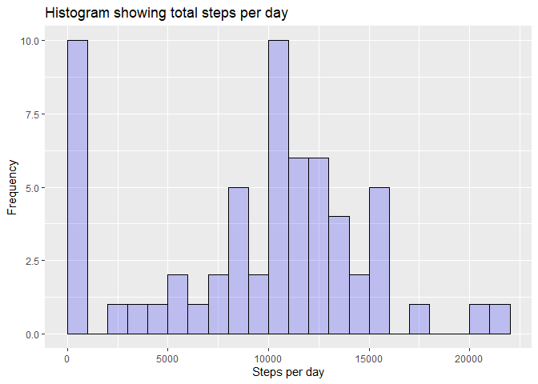
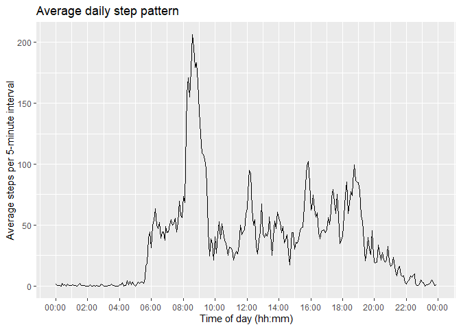
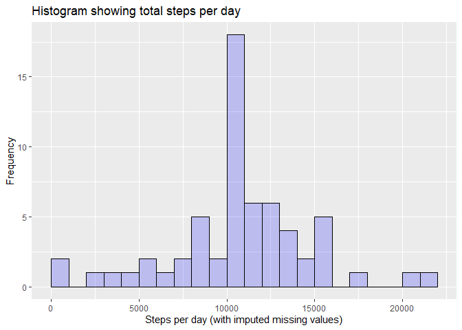
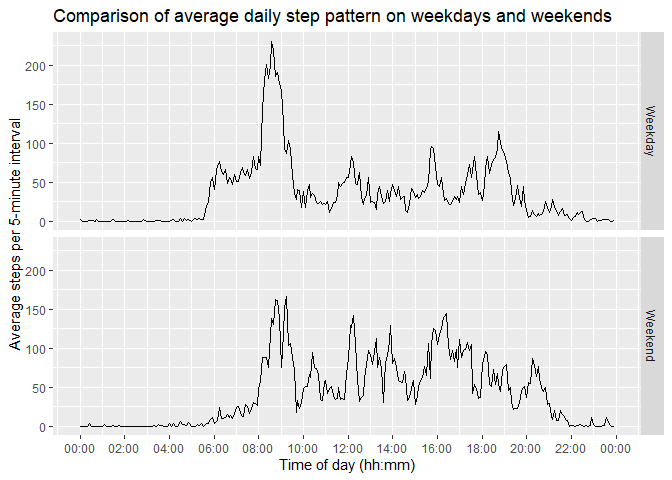

---
title: "Reproducible Research - Course Project 1"
author: "Tom Nechleba"
date: "24/02/2020"
output: html_document
---


```r
knitr::opts_chunk$set(echo = TRUE)
```


## Dependancies
The following packages are used:

* tidyverse
* lubridate
* data.table
* hms
* forcats


```r
library(data.table)
library(tidyverse)
```

```
## -- Attaching packages ------------------------------------------------------- tidyverse 1.3.0 --
```

```
## v ggplot2 3.2.1     v purrr   0.3.3
## v tibble  2.1.3     v dplyr   0.8.3
## v tidyr   1.0.0     v stringr 1.4.0
## v readr   1.3.1     v forcats 0.4.0
```

```
## -- Conflicts ---------------------------------------------------------- tidyverse_conflicts() --
## x dplyr::between()   masks data.table::between()
## x dplyr::filter()    masks stats::filter()
## x dplyr::first()     masks data.table::first()
## x dplyr::lag()       masks stats::lag()
## x dplyr::last()      masks data.table::last()
## x purrr::transpose() masks data.table::transpose()
```

```r
library(hms)
library(lubridate)
```

```
## 
## Attaching package: 'lubridate'
```

```
## The following object is masked from 'package:hms':
## 
##     hms
```

```
## The following objects are masked from 'package:data.table':
## 
##     hour, isoweek, mday, minute, month, quarter, second, wday, week,
##     yday, year
```

```
## The following object is masked from 'package:base':
## 
##     date
```

```r
library(forcats)
options(lubridate.week.start = 1)
```

## Reading the data in


```r
unzip("activity.zip")
activity_raw <- fread("activity.csv")
activity <- activity_raw %>%
  as_tibble() %>%
  mutate(Date = ymd(date),
         IntervalMod = case_when(
           interval < 10 ~ paste0("00:0", interval, ":00"),
           interval < 100 ~ paste0("00:", interval, ":00"),
           interval < 1000 ~ paste0("0", substr(interval, 1, 1), ":", substr(interval, 2, 3), ":00"),
           TRUE ~ paste0(substr(interval, 1, 2), ":", substr(interval, 3, 4), ":00")),
         Interval = as_hms(IntervalMod),
         IntervalForPlot = paste(today(), Interval) %>% as_datetime()) %>%
  select(Steps = steps, Date, Interval, IntervalForPlot)
```


## Mean total number of steps per day
For this section, we are ignoring missing values.


```r
total_per_day <- activity %>%
  group_by(Date) %>%
  summarise(StepsPerDay = sum(Steps, na.rm = TRUE)) %>%
  ungroup()

summaries_per_day <- total_per_day %>%
  summarise(MeanTotalPerDay = mean(StepsPerDay, na.rm = TRUE),
            MedianTotalPerDay = median(StepsPerDay, na.rm = TRUE))

mean_per_day <- pull(summaries_per_day, MeanTotalPerDay)
median_per_day <- pull(summaries_per_day, MedianTotalPerDay)
```

The mean is 9354.23 steps per day and the median is 10395
steps per day.

### Total steps per day 
A histogram of the total steps per day follows.


```r
ggplot(data = total_per_day, aes(StepsPerDay)) +
  geom_histogram(binwidth = 1000, 
                 boundary = 0, 
                 closed = "left", 
                 fill = I("blue"), 
                 col = I("black"),
                 alpha = I(.2)) +
  ggtitle("Histogram showing total steps per day") + 
  xlab("Steps per day") + 
  ylab("Frequency")
```

<!-- -->

### Average daily activity pattern

A time series plot showing the average daily activity pattern follows.


```r
daily_pattern <- activity %>%
  group_by(IntervalForPlot) %>%
  summarise(MeanStepsInInterval = mean(Steps, na.rm = TRUE)) %>%
  ungroup()

max_interval <- daily_pattern %>%
  filter(MeanStepsInInterval == max(MeanStepsInInterval))

ggplot(daily_pattern, aes(x = IntervalForPlot, y = MeanStepsInInterval)) + 
  geom_line() + 
  scale_x_datetime(breaks = scales::date_breaks("2 hours"), date_labels = "%H:%M") + 
  ggtitle("Average daily step pattern") + 
  xlab("Time of day (hh:mm)") +
  ylab("Average steps per 5-minute interval")
```

<!-- -->

On average, the most active 5-minute interval was that commencing at 2020-02-24 08:35:00 with a mean step count of 206.1698113.


## Imputing missing values


```r
count_na <- activity %>%
  filter(is.na(Steps)) %>%
  count() %>%
  pull(n)
```

There are a total of **2304** missing values in the data, recorded as "NA". These may affect the accuracy of the previous calculations.

To remedy this, we have devised a strategy to impute the missing values by replacing them with the mean value for the given 5-minute interval across the dataset. 


```r
activity_imp <- activity %>% 
  left_join(daily_pattern, "IntervalForPlot") %>%
  mutate(StepsImp = case_when(
    is.na(Steps) ~ MeanStepsInInterval,
    TRUE ~ as.double(Steps)))
```


Using this new data set, we have redrawn the histogram of steps per day and recalculated the measures of centrality.


```r
total_per_day_imp <- activity_imp %>%
  group_by(Date) %>%
  summarise(StepsPerDayImp = sum(StepsImp)) %>%
  ungroup()

ggplot(data = total_per_day_imp, aes(StepsPerDayImp)) +
  geom_histogram(binwidth = 1000, 
                 boundary = 0, 
                 closed = "left", 
                 fill = I("blue"), 
                 col = I("black"),
                 alpha = I(.2)) +
  ggtitle("Histogram showing total steps per day") + 
  xlab("Steps per day (with imputed missing values)") + 
  ylab("Frequency")
```

<!-- -->

```r
summaries_per_day_imp <- total_per_day_imp %>%
  summarise(MeanTotalPerDayImp = mean(StepsPerDayImp),
            MedianTotalPerDayImp = median(StepsPerDayImp))


mean_per_day_imp <- pull(summaries_per_day_imp, MeanTotalPerDayImp)
median_per_day_imp <- pull(summaries_per_day_imp, MedianTotalPerDayImp)
```

The recalculated measures of centrality are as follows:

* mean: 10766.19 steps per day (cf. pre-imputation 9354.23)
* median: 10766.19 steps per day (cf. pre-imputation 10395)

The effect of the imputation of missing values has been to all but remove 0-step days, thus bringing the mean and median values closer together (in fact, they are now identical as chance would have it). This is because we have introduced a number of forcibly average days into the data set.

## Differences in activity patterns between weekdays and weekends

The below plot shows a comparison of the average daily step pattern on weekdays and weekends, using the data set with imputed missing values.


```r
activity_we <- activity_imp %>%
  mutate(DayType = as_factor(case_when(
    wday(Date) < 6 ~ "Weekday",
    TRUE ~ "Weekend")))

daily_pattern_we <- activity_we %>%
  group_by(IntervalForPlot, DayType) %>%
  summarise(MeanStepsInIntervalImp = mean(StepsImp)) %>%
  ungroup()

ggplot(daily_pattern_we, aes(x = IntervalForPlot, y = MeanStepsInIntervalImp)) + 
  geom_line() + 
  scale_x_datetime(breaks = scales::date_breaks("2 hours"), date_labels = "%H:%M") + 
  ggtitle("Comparison of average daily step pattern on weekdays and weekends") + 
  xlab("Time of day (hh:mm)") +
  ylab("Average steps per 5-minute interval") + 
  facet_grid(DayType ~ .)
```

<!-- -->
